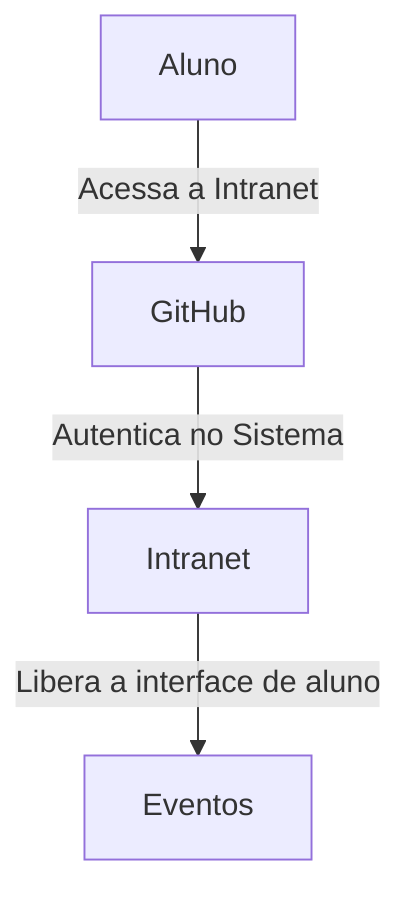

# Codaqui Intranet

## Objetivo

A ideia básica é criar um sistema que o aluno consiga criar sua conta com o GitHub e acessar a intranet da Codaqui.



## Desenvolvimento

### Executando o Projeto

```bash
poetry install
poetry run python manage.py migrate 
poetry run python manage.py runserver
```

### Criando um Super Usuário

```bash
poetry run python manage.py createsuperuser
```

### Criando um App

```bash
poetry run python manage.py startapp <nome_do_app>
```

### Criando um Modelo

```bash
poetry run python manage.py makemigrations
```

## Tecnologia

- [Python](https://www.python.org/)
- [Poetry](https://python-poetry.org/)
- [Django](https://www.djangoproject.com/)