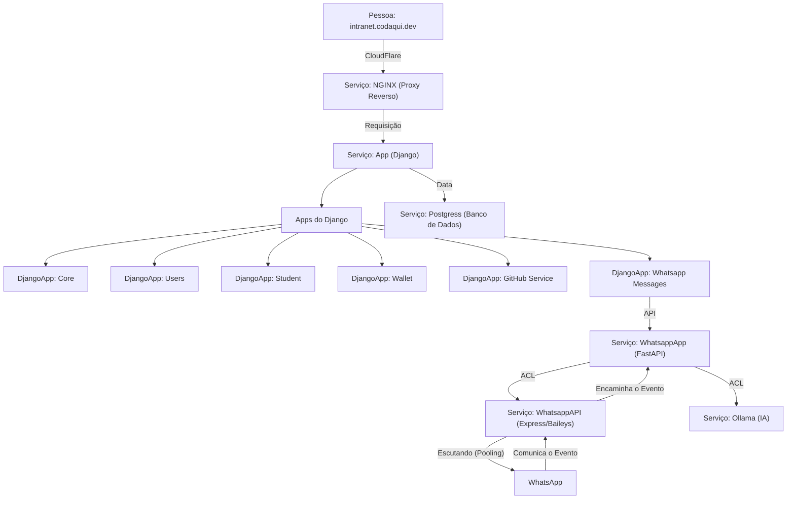

# Codaqui Intranet

[](https://github.com/codaqui/tutor/actions/workflows/build_and_deploy.yml)

## Resumo da Estrutura Atual



## Objetivo

A ideia básica é criar um sistema que o aluno consiga criar sua conta com o GitHub e acessar a intranet da Codaqui.

- [X] Sistema de login via GitHub.
  - [X] Receber convite para fazer parte do time: https://github.com/orgs/codaqui/teams/intranet
  - [X] Validar se a pessoa faz parte do time no GitHub.
- [X] Perfil de Estudante
- [X] Criar um sistema de completar o cadastro.
- [X] Sistema de Carteira
  - [X] Usuário poder ter uma carteira.
    - [X] A ativação da conta é feita por uma custom action e automaticamente cria a carteira.
  - [X] Usuário pode consultar seus pontos.
  - [X] Usuário pode consultar histórico de transações na sua conta.
- [X] Criar um repositório para salvar as Issues da Intranet.
  - Vamos utilizar o proprio repositório do Tutor, ainda não foi definido um padrão.
- [X] GitHub Service
  - [X] Consumir rotas da API com o App GitHub.
- [ ] Sistema de Tarefas (Integração com o GitHub)
  - [X] Usuário o pode ver as tarefas disponíveis.
  - [X] O usuário pode se candidatar a uma tarefa disponível.
  - [ ] O usuário pode solicitar ajuda/mais informações sobre a tarefa que está realizando.
  - [ ] O usuário pode concluir (enviar para analise) a tarefa.
  - [ ] O usuário pode saber o resultado da analise.
- [ ] Atualizar a Wallet para poder associar uma Issue na transação. (opcional)
- [ ] Loja Virtual
  - [ ] Escolher item.
  - [ ] Revisão.
- [ ] Testes Básicos
  - [X] Exemplo de Testes
  - [ ] Aumentar Cobertura
- [ ] Pré - Deploy - v1
  - [X] Lint e iSort do Projeto
  - [X] Escolher um Postgres da vida.
  - [X] Build da Imagem em AMD64 e ARM64.
  - [X] Deploy na Raspberry PI (Teste) 
- [ ] Rever fluxos de formulários, verificar se tem como cair em alguma exceção.
- [ ] Criar página para editar perfil separada, para facilitar manutenção.
- [ ] Resetar o banco de dados e partir como v1.

### Futuros Apps

- [ ] App de Integração com o Discord
  - [ ] Presença em Monitoria/Encontro
  - [ ] Mensagem automática de Encontro e Resumo do Encontro
  - [ ] Pontos automáticos para lista de presença.
- [ ] Bot de Discord
  - [ ] Ranking de Pontuação
  - [ ] Consultar/Editar perfil
  - [ ] Vinculo de Perfil do Discord para Perfil da Codaqui
    - [ ] Modelo do Discord
    - [ ] 1:1 com Stundent
    - [ ] Integração de Carteira e Pontos

### Melhorias de Infraestrutura

- [ ] Cobertura de Testes
- [ ] Modo de Desenvolvimento com Docker

## Desenvolvimento


### Criando dotenv 

```bash
# Execute o comando abaixo para criar o arquivo .env
cp .env.example .env

# Abra o arquivo e preencha com as secrets, se você não sabe como conseguir entre em contato com o time de desenvolvimento.
```

### Secrets Especiais para o GitHub

1. Crie uma organização no GitHub.
2. Crie um time chamado `intranet`.
3. Crie um OAuth App para sua Organização.
4. Crie um App para sua organização.

Preencha as secrets do arquivo `.env` com os valores que você obteve.


### Executando o Projeto

```bash
docker compose up --build
```

### Criando um Super Usuário

```bash
# Utilize o Docker Desktop para executar o comando abaixo dentro do container.
python manage.py createsuperuser
```

#### Alterando seu usuário para super usuário

```bash
# Acesse o shell do Django
python manage.py shell

# Acesse o usuário que você deseja alterar
from users.models import User

# Lista todos os usuários
users = User.objects.all()

# Altera o usuário para super usuário
user = User.objects.get(username='<username>')
user.is_superuser = True
user.is_staff = True
user.save()

```

### Criando um App

```bash
poetry run python manage.py startapp <nome_do_app>
```

### Criando um Modelo

```bash
poetry run python manage.py makemigrations
```

## Tecnologia

- [Python](https://www.python.org/)
- [Poetry](https://python-poetry.org/)
- [Django](https://www.djangoproject.com/)
- [Docker](https://www.docker.com/)
