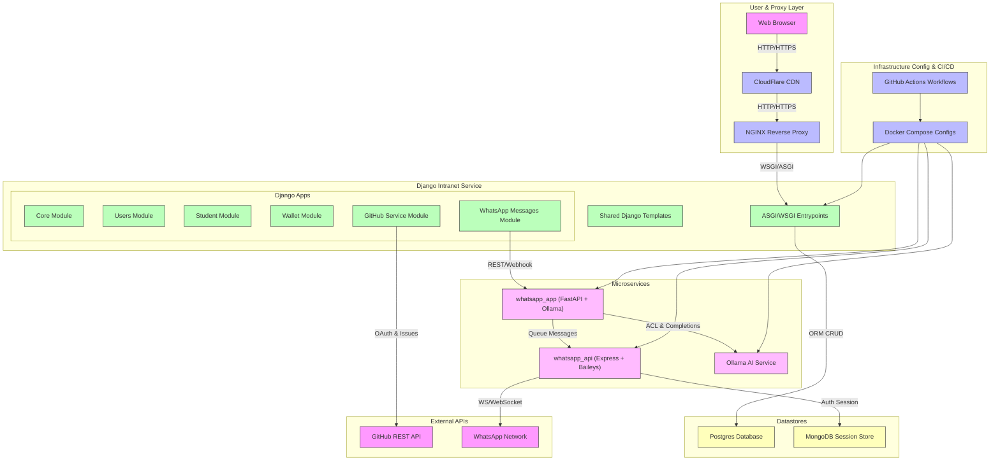

# 🚀 Codaqui Intranet

[](https://github.com/codaqui/tutor/actions/workflows/build_and_deploy.yml)


## 🛠️ Resumo da Estrutura Atual



## 📌 Objetivo

A ideia básica é criar um sistema que o aluno consiga criar sua conta com o GitHub e acessar a intranet da Codaqui.

- [✅] Sistema de login via GitHub.
  - [✅] Receber convite para fazer parte do time: https://github.com/orgs/codaqui/teams/intranet
  - [✅] Validar se a pessoa faz parte do time no GitHub.
- [✅] Perfil de Estudante
- [✅] Criar um sistema de completar o cadastro.
- [✅] Sistema de Carteira
  - [✅] Usuário poder ter uma carteira.
    - [✅] A ativação da conta é feita por uma custom action e automaticamente cria a carteira.
  - [✅] Usuário pode consultar seus pontos.
  - [✅] Usuário pode consultar histórico de transações na sua conta.
- [✅] Criar um repositório para salvar as Issues da Intranet.
  - Vamos utilizar o proprio repositório do Tutor, ainda não foi definido um padrão.
- [✅] GitHub Service
  - [✅] Consumir rotas da API com o App GitHub.
- [❌] Sistema de Tarefas (Integração com o GitHub)
  - [✅] Usuário o pode ver as tarefas disponíveis.
  - [✅] O usuário pode se candidatar a uma tarefa disponível.
  - [✅] O usuário pode solicitar ajuda/mais informações sobre a tarefa que está realizando.
  - [❌] O usuário pode concluir (enviar para analise) a tarefa.
  - [❌] O usuário pode saber o resultado da analise.
- [❌] Atualizar a Wallet para poder associar uma Issue na transação. (opcional)
- [❌] Loja Virtual
  - [❌] Escolher item.
  - [❌] Revisão.
- [❌] Testes Básicos
  - [✅] Exemplo de Testes
  - [❌] Aumentar Cobertura
- [❌] Pré - Deploy - v1
  - [✅] Lint e iSort do Projeto
  - [✅] Escolher um Postgres da vida.
  - [✅] Build da Imagem em AMD64 e ARM64.
  - [✅] Deploy na Raspberry PI (Teste) 
- [❌] Rever fluxos de formulários, verificar se tem como cair em alguma exceção.
- [❌] Criar página para editar perfil separada, para facilitar manutenção.
- [❌] Resetar o banco de dados e partir como v1.

### Futuros Apps

- [❌] App de Integração com o Discord
  - [❌] Presença em Monitoria/Encontro
  - [❌] Mensagem automática de Encontro e Resumo do Encontro
  - [❌] Pontos automáticos para lista de presença.
- [❌] Bot de Discord
  - [❌] Ranking de Pontuação
  - [❌] Consultar/Editar perfil
  - [❌] Vinculo de Perfil do Discord para Perfil da Codaqui
    - [❌] Modelo do Discord
    - [❌] 1:1 com Stundent
    - [❌] Integração de Carteira e Pontos

### Melhorias de Infraestrutura

- [❌] Cobertura de Testes
- [❌] Modo de Desenvolvimento com Docker

## ⚙️ Desenvolvimento Com Docker

### 🎥 Como usar o projeto (vídeo)

`Para entender como utilizar o projeto, assista ao vídeo prático de instalação e uso, clicando na imagem a baixo.`

[](https://www.youtube.com/watch?v=0SDqCDb57HM)


### 🔑 Criando dotenv 

```bash
# Execute o comando abaixo para criar o arquivo .env
cp .env.example .env

# Abra o arquivo e preencha com as secrets, se você não sabe como conseguir entre em contato com o time de desenvolvimento.
```

### 🔒 Secrets Especiais para o GitHub

1. Crie uma organização no GitHub.
2. Crie um time chamado `intranet`.
3. Crie um OAuth App para sua Organização.
4. Crie um App para sua organização.

Preencha as secrets do arquivo `.env` com os valores que você obteve.


### ✅ Executando o Projeto

```bash
docker compose up --build
```

### 🌟 Criando um Super Usuário

```bash
# Utilize o Docker Desktop para executar o comando abaixo dentro do container.
python manage.py createsuperuser
```

#### 🔃 Alterando seu usuário para super usuário

```bash
# Acesse o shell do Django
python manage.py shell

# Acesse o usuário que você deseja alterar
from users.models import User

# Lista todos os usuários
users = User.objects.all()

# Altera o usuário para super usuário
user = User.objects.get(username='<username>')
user.is_superuser = True
user.is_staff = True
user.save()

```

### 🖥️ Criando um App

```bash
poetry run python manage.py startapp <nome_do_app>
```

### 🖥️ Criando um Modelo

```bash
poetry run python manage.py makemigrations
```

## ⚙️ Desenvolvimento Sem Docker (Usando SQLite3 e sem NGINX)

### 🔒 Secrets Especiais para o GitHub

1. Crie uma organização no GitHub.
2. Crie um time chamado `intranet`.
3. Crie um OAuth App para sua Organização.
4. Crie um App para sua organização.

Preencha as secrets do arquivo `.env` com os valores que você obteve.


### ⬇️ Instale o Poetry

Siga as instruções oficiais para instalar o Poetry no seu sistema:
[Documentação do Poetry](https://python-poetry.org/docs/#installation).

Após a instalação, verifique se o Poetry foi instalado corretamente:
```bash
poetry install
```

### 🔨 Configure o banco de dados para usar SQLite3

No diretório do projeto `/codaqui/`, abra o arquivo `settings.py`.

Substitua a configuração existente pelo seguinte código para usar o SQLite3 como banco de dados:

```python
DATABASES = {
 "default": {
     "ENGINE": "django.db.backends.sqlite3",
     "NAME": "sqlite3",
 }
}
```

### ✅ Executando o Projeto

```bash
poetry run python manage.py migrate 
poetry run python manage.py runserver
```
### 🌟 Criando um Super Usuário

```bash
poetry run python manage.py createsuperuser
```

#### 🔃 Alterando seu usuário para super usuário

```bash
# Acesse o shell do Django
python manage.py shell

# Acesse o usuário que você deseja alterar
from users.models import User

# Lista todos os usuários
users = User.objects.all()

# Altera o usuário para super usuário
user = User.objects.get(username='<username>')
user.is_superuser = True
user.is_staff = True
user.save()

```

### 🖥️ Criando um App

```bash
poetry run python manage.py startapp <nome_do_app>
```

### 🖥️ Criando um Modelo

```bash
poetry run python manage.py makemigrations
```
Agora você pode usar o modelo criado no banco de dados SQLite3 sem precisar de Docker. 😊


## ✨ Tecnologia (Stack)

- [Python](https://www.python.org/)
- [Poetry](https://python-poetry.org/)
- [Django](https://www.djangoproject.com/)
- [Docker](https://www.docker.com/)
- [Ollama](https://ollama.com/)
  - [Modelfile](https://github.com/ollama/ollama/blob/main/docs/modelfile.md)

## ✨ APIs

Abaixo estão os endpoints que foram utilizados para o projeto, caso tenha interesse em estudar mais sobre eles, acesse os links abaixo:

- [GitHub](https://docs.github.com/en/rest/issues?apiVersion=2022-11-28) -- (github_service)
- [WhatsApp using Baileys](https://baileys.wiki/docs/intro)


